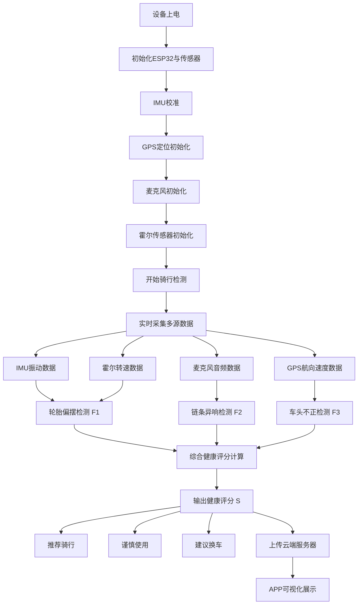
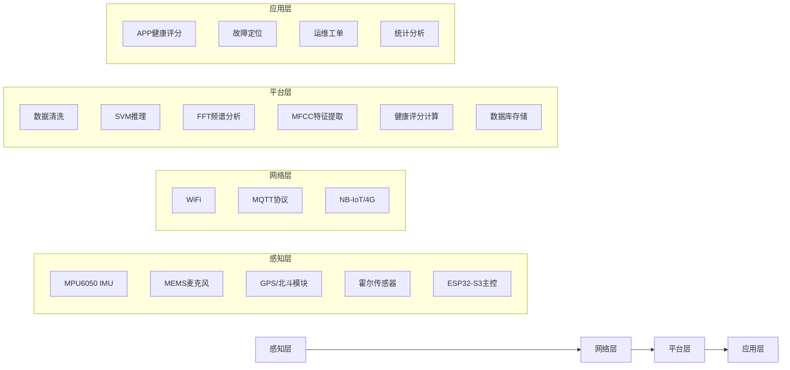
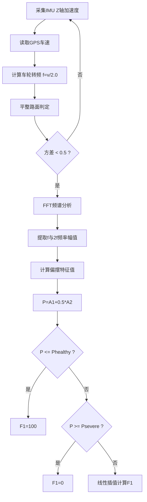
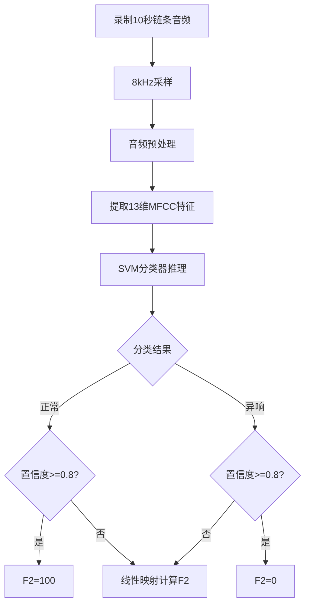
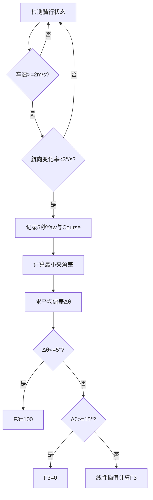
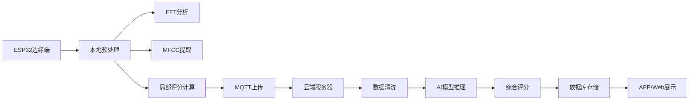

# 共享单车健康快速检测系统

## 算法流程图与算法框图设计文档

---

# 1. 系统整体工作流程图



---

# 2. 系统总体架构框图



---

# 3. 轮胎偏摆检测算法流程图（F1）

## 算法思想

通过 IMU Z轴加速度信号进行 FFT 频域分析，识别与车轮转速相关的周期性振动，从而判断轮胎是否偏摆。



---

# 4. 链条异响检测算法流程图（F2）

## 算法思想

利用麦克风采集链条声音，通过 MFCC 提取声纹特征，再使用 SVM 分类器识别链条是否异响。



---

# 5. 车头不正检测算法流程图（F3）

## 算法思想

通过比较 IMU 偏航角与 GPS 航向角之间的偏差，评估车把是否存在固定偏斜。



---

# 6. 综合健康评分算法框图

## 算法思想

采用：

* 加权调和平均
* 最小值惩罚机制

体现“木桶效应”。

```mermaid
flowchart TD

A[F1 轮胎偏摆] --> D
B[F2 链条异响] --> D
C[F3 车头不正] --> D

D[计算加权调和平均 H]

D --> E[H=1/(0.4/F1+0.3/F2+0.3/F3)]

A --> F
B --> F
C --> F

F[计算最小值惩罚]

F --> G[penalty=min(F1,F2,F3)/100]

E --> H
G --> H

H[最终评分 S=H×penalty]

H --> I{S>=70?}

I -- 是 --> J[推荐骑行]

I -- 否 --> K{S>=50?}

K -- 是 --> L[谨慎使用]

K -- 否 --> M[建议换车]

```

---

# 7. 边缘计算与云端协同框图



---

# 8. 数据流转流程图


---

# 9. 算法设计核心优势

## 9.1 多传感器融合

* IMU → 振动与姿态
* 麦克风 → 声纹特征
* GPS → 航向与速度
* 霍尔 → 车轮转速

实现多维故障检测。

---

## 9.2 边缘计算

ESP32 本地完成：

* FFT
* MFCC
* SVM推理

降低云端压力。

---

## 9.3 木桶效应评分机制

通过：

```text
S = H × penalty
```

避免：

* 某项严重故障被高分掩盖
* 综合评分失真

更加符合真实骑行体验。

---

# 10. 系统总结

本系统采用：

* 多传感器融合
* 边缘智能计算
* 机器学习分类
* 加权调和平均评分

实现共享单车软故障的：

* 自动化
* 低成本
* 快速检测
* 可量化评估

为共享单车企业提供智能化运维方案。
